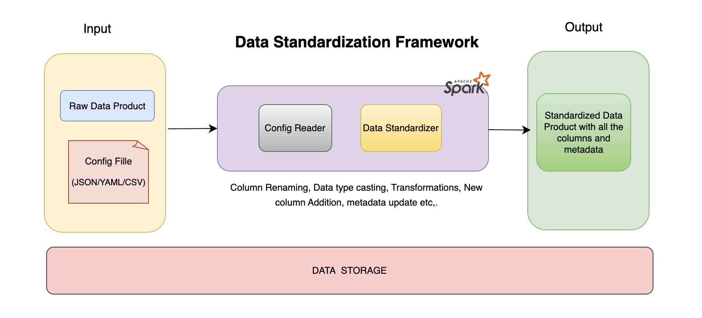

# 🛠 Config Driven Data Standardization using Spark

## Overview

This project aims to provide a generic solution for data standardization that can be easily configured and integrated into existing data pipelines. Config-driven data standardization is a process that uses configuration files to define the rules and mappings for standardizing raw data into a consistent format. The codebase uses Pyspark and Spark SQL to implement the standardization logic. The configuration file is written in JSON format.

## Key Features 🌟

- This approach decouples the transformation logic from the application code, enhancing flexibility and maintainability. 
- It involves renaming columns, changing data types, adding descriptions, performing necessary transformations, and adding new columns based on the provided configurations.
- Easy integration with existing data pipelines 🔄
- Extensible and customizable architecture 🔧

## Getting Started 🚀

A tutorial blog post is published on Medium that explains the implementation details and provides a step-by-step guide to get started with this project and apply it to your data pipelines. It also includes a sample dataset and configuration file to demonstrate the working of this project.
You can find the blog post [here](https://medium.com/@saurabhkumar_4718/config-driven-data-standardization-6f3b3f3b3b3b).

- The code can be found in `data_standardization.py` which contains the implementation of the data standardization logic along with the example run.
- The config template can be found in `config_template.json` which contains the structure of the configuration file.
- The example config file used in the code can be found in `config.json` which contains the rules and mappings for standardizing the raw data.

For more details, please refer to the blog post.

## Contributing 🤝

Contributions are welcome! If you have any ideas, suggestions, or bug reports, please open an issue or submit a pull request.

## License 📄

This project is licensed under the MIT License. See the `LICENSE` file for more information.